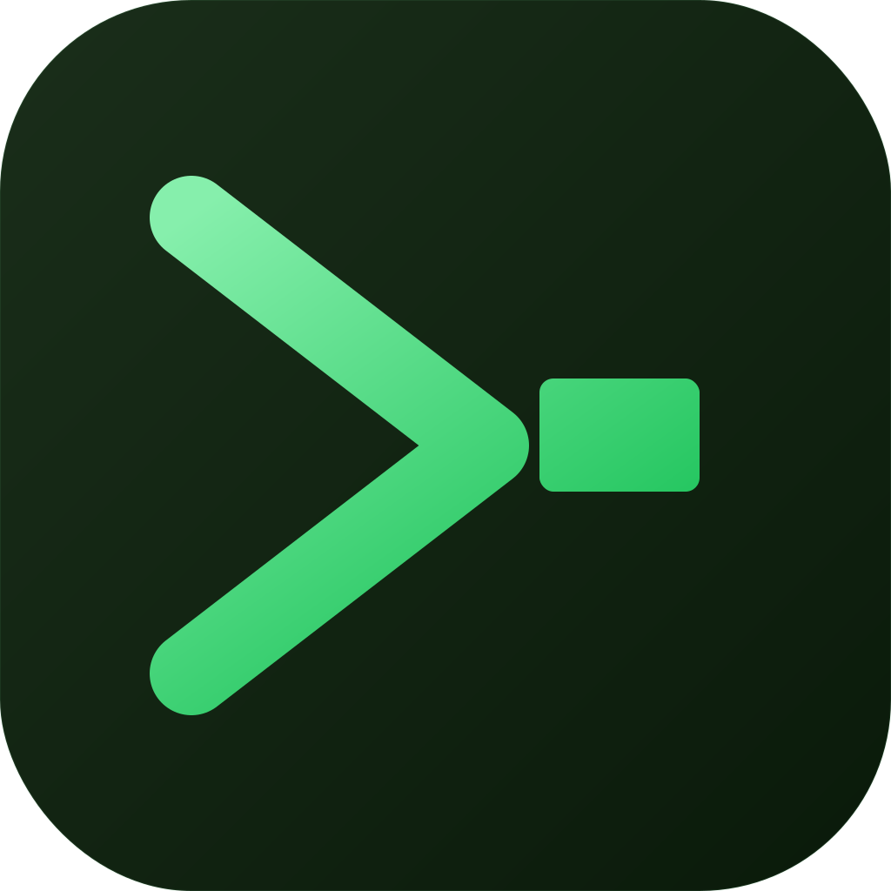

# Claudesole

A multi-tab terminal emulator for [Claude Code](https://claude.ai/code) built with Electron, React, and xterm.js.



## Features

- **Multi-tab PTY terminals** — each tab runs a real Claude Code session
- **Session picker** — browse and resume historical sessions with prompt previews
- **Session history panel** (⌘H) — full searchable history with first + latest prompt, resume or fork any session
- **Real fork support** — `--resume <id> --fork-session` creates a true diverging copy of a conversation
- **Session sidebar** (⌘B) — running sessions with status, prompt, and fork button
- **Tab management** — rename (double-click), pin (★), right-click context menu, ⌘1–9 switching, ⌘W close
- **Idle notifications** — macOS notification when Claude finishes responding (only fires on Claude output, not keystrokes)
- **Dock badge** — count of sessions waiting for input
- **⌘F search**, **⌘K clear**, 10,000-line scrollback
- **`--dangerously-skip-permissions`** on by default, **`--worktree`** support

## Requirements

- macOS (uses native PTY and macOS notifications)
- [Claude Code CLI](https://claude.ai/code) installed and on `$PATH` (`claude`)
- Node.js 18+

## Development

```bash
npm install
npm run dev
```

## Production build

```bash
# Generate the app icon (one-time, or when icon.svg changes)
npm run make-icon

# Build distributable .dmg for arm64 + x64
npm run dist
```

The DMG is output to `dist/`.

## Keyboard shortcuts

| Shortcut | Action |
|----------|--------|
| ⌘T | New session |
| ⌘W | Close active tab |
| ⌘B | Toggle session sidebar |
| ⌘H | Toggle session history panel |
| ⌘1–9 | Switch to tab by index |
| ⌘F | Find in terminal |
| ⌘K | Clear terminal |

## Stack

- [Electron](https://www.electronjs.org/) + [electron-vite](https://electron-vite.org/)
- [React](https://react.dev/) + [TypeScript](https://www.typescriptlang.org/)
- [xterm.js](https://xtermjs.org/) (`@xterm/xterm`) + FitAddon + SearchAddon
- [node-pty](https://github.com/microsoft/node-pty) for PTY spawning
- [Zustand](https://zustand-demo.pmnd.rs/) for state management
